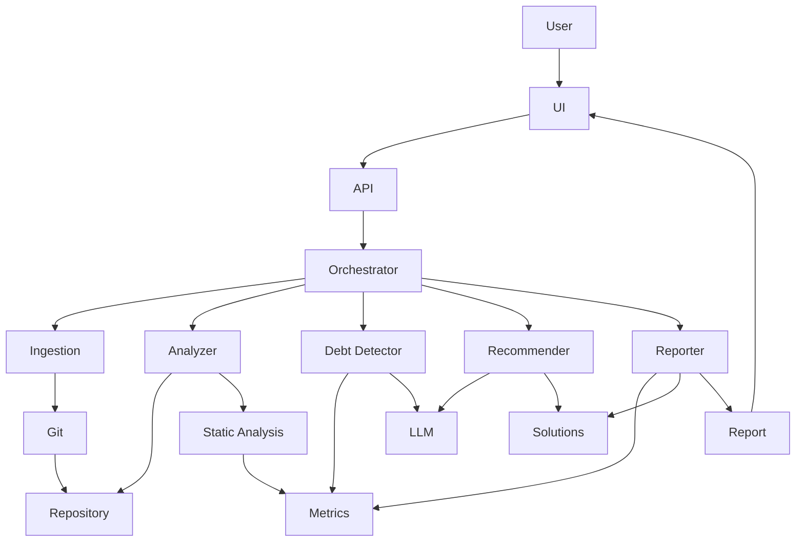
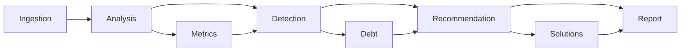
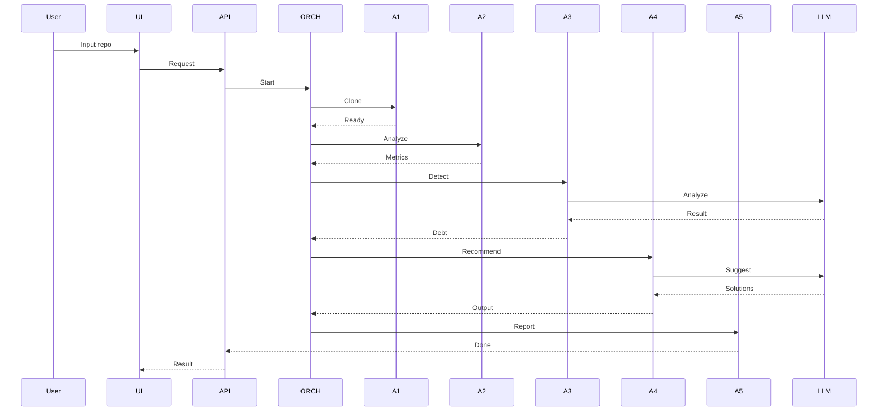
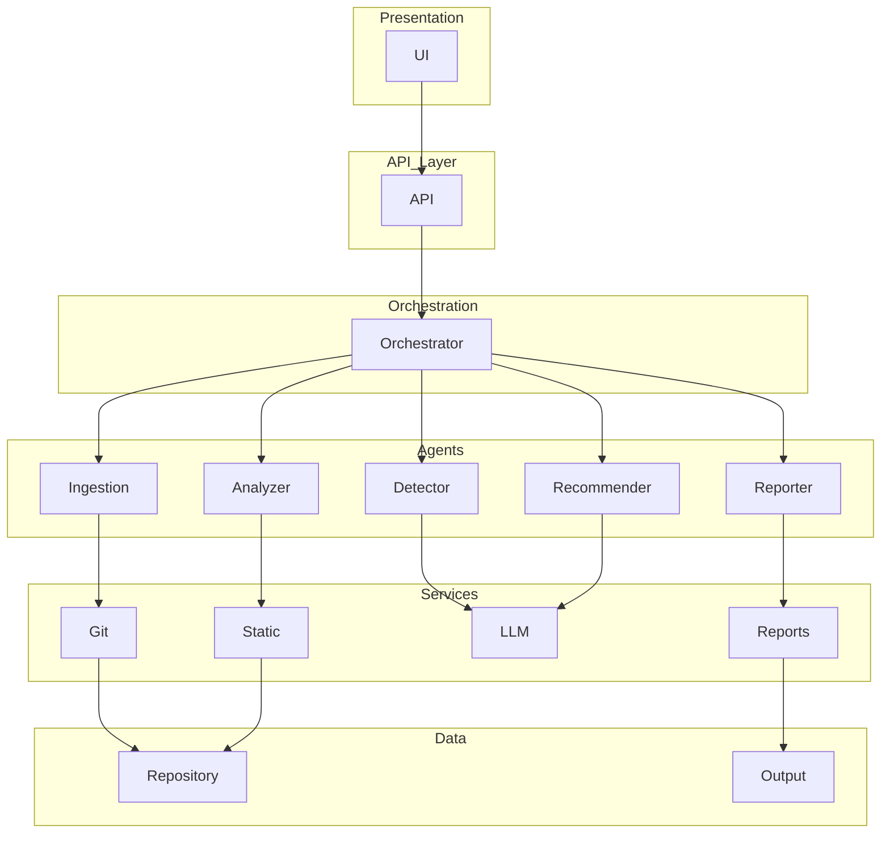

# Conceptual Architecture

## Overview

This project proposes a multiagent system to detect technical debt associated with Non-Functional Requirements (NFR), focusing on maintainability.

---

## High-Level Architecture

---

## Agent Workflow

---

## Sequence Diagram

---

## Layered Architecture

---

## Explanation

### Multiagent Design

The system is divided into specialized agents:

- Code Ingestion Agent: clones and prepares repository  
- Repository Analyzer Agent: extracts structural and metric data  
- NFR Debt Detector Agent: identifies maintainability issues  
- Solution Recommender Agent: proposes improvements  
- Report Generator Agent: produces final report  

---

### Hybrid Analysis

The system combines:

- Static analysis → objective metrics  
- LLM reasoning → semantic understanding  

---

### Key Benefits

- Modular architecture  
- Scalable design  
- Explainable results  
- AI-assisted recommendations  

---

## Technology Stack

- Python  
- FastAPI  
- Streamlit  
- OpenAI API  
- Radon / Lizard / Semgrep  
- GitPython  